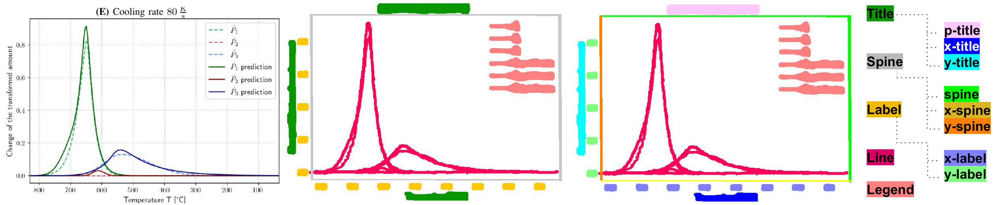

# LG Dataset

[**Download Link**](https://drive.google.com/drive/folders/128mshEziUfrWrFtVWVL8qpswbvmPTAkb?usp=sharing) | [**Paper**](https://link.springer.com/chapter/10.1007/978-3-031-41734-4_27) | [**Video**](https://youtu.be/dK3YmN62kJc)

## Description
we introduce the task of fine-grained visual understanding of mathematical graphics and present the [Line Graphics (LG) dataset](https://link.springer.com/chapter/10.1007/978-3-031-41734-4_27), which includes pixel-wise annotations of 5 coarse and 10 fine-grained categories. Our dataset covers 520 images of mathematical graphics collected from 450 documents from different disciplines.
 
## Samples
  Diverse mathematical graphics are covered in our Line Graphics (LG) dataset, including 100 bar charts (a) 320 line graphics (b,d-f), and 100 scatter plots (c). Each sample poses a significant challenge for existing chart analysis methods.

<table style="padding:10px">
     <tr>
        <td style="text-align:center">
            Images 
        </td>
    </tr>
    <tr>
        <td style="text-align:center"> 
            
        </td>
    </tr>
    <tr>
        <td style="text-align:center">
            Annotations 
        </td>
    </tr>
    <tr>
        <td style="text-align:center"> 
            
        </td>
    </tr>


</table>

# Getting Started 

#### Download the dataset from [Here](https://drive.google.com/drive/folders/128mshEziUfrWrFtVWVL8qpswbvmPTAkb?usp=sharing)

## Model Zoo
In this section, we release the pre-trained weights for all the best DocEnTr model variants trained on benchmark datasets.

<table class="tg">
<thead>
  <tr>
    <th class="tg-amwm"><span style="font-style:normal;text-decoration:none;color:#000;background-color:transparent">Dataset</span></th>
    <th class="tg-amwm"><span style="font-style:normal;text-decoration:none;color:#000;background-color:transparent">Config-file</span></th>
    <th class="tg-amwm"><span style="font-style:normal;text-decoration:none;color:#000;background-color:transparent">Weights</span></th>
    <th class="tg-amwm"><span style="font-style:normal;text-decoration:none;color:#000;background-color:transparent">AP</span></th>
  </tr>
</thead>
<tbody>
  <tr>
    <td class="tg-baqh"><span style="font-weight:400;font-style:normal;text-decoration:none;color:#000;background-color:transparent">PublayNet</span></td>
    <td class="tg-baqh"><span style="font-weight:400;font-style:normal;text-decoration:none;color:#000;background-color:transparent"><a href=https://github.com/ayanban011/SwinDocSegmenter/blob/main/configs/coco/instance-segmentation/swin/config_publay.yaml>config-publay</a></span></td>
    <td class="tg-baqh"><span style="font-weight:400;font-style:normal;text-decoration:none;color:#000;background-color:transparent"><a href=https://drive.google.com/file/d/1DCxG2MCza_z-yB3bLcaVvVR4Jik00Ecq/view?usp=share_link>model</a></span></td>
    <td class="tg-baqh"><span style="font-weight:400;font-style:normal;text-decoration:none;color:#000;background-color:transparent">93.72</span></td>
  </tr>
  <tr>
    <td class="tg-baqh"><span style="font-weight:400;font-style:normal;text-decoration:none;color:#000;background-color:transparent">Prima</span></td>
    <td class="tg-baqh"><span style="font-weight:400;font-style:normal;text-decoration:none;color:#000;background-color:transparent"><a href=https://github.com/ayanban011/SwinDocSegmenter/blob/main/configs/coco/instance-segmentation/swin/config_prima.yaml>config-prima</a></span></td>
    <td class="tg-baqh"><span style="font-weight:400;font-style:normal;text-decoration:none;color:#000;background-color:transparent"><a href=https://drive.google.com/file/d/1DNX9HQ0aG5ws0HCTFBUeV__rTlifNsvq/view?usp=share_link>model</a></span></td>
    <td class="tg-baqh"><span style="font-weight:400;font-style:normal;text-decoration:none;color:#000;background-color:transparent">54.39</span></td>
  </tr>
  <tr>
    <td class="tg-baqh"><span style="font-weight:400;font-style:normal;text-decoration:none;color:#000;background-color:transparent">HJ Dataset</span></td>
    <td class="tg-baqh"><span style="font-weight:400;font-style:normal;text-decoration:none;color:#000;background-color:transparent"><a href=https://github.com/ayanban011/SwinDocSegmenter/blob/main/configs/coco/instance-segmentation/swin/config_hj.yaml>config-hj</a></span></td>
    <td class="tg-baqh"><span style="font-weight:400;font-style:normal;text-decoration:none;color:#000;background-color:transparent"><a href=https://drive.google.com/file/d/1DNX9HQ0aG5ws0HCTFBUeV__rTlifNsvq/view?usp=share_link>model</a></span></td>
    <td class="tg-baqh"><span style="font-weight:400;font-style:normal;text-decoration:none;color:#000;background-color:transparent">84.65</span></td>
  </tr>
  <tr>
    <td class="tg-baqh"><span style="font-weight:400;font-style:normal;text-decoration:none;color:#000;background-color:transparent">TableBank</span></td>
    <td class="tg-baqh"><span style="font-weight:400;font-style:normal;text-decoration:none;color:#000;background-color:transparent"><a href=https://github.com/ayanban011/SwinDocSegmenter/blob/main/configs/coco/instance-segmentation/swin/config_table.yaml>config-table</a></span></td>
    <td class="tg-baqh"><span style="font-weight:400;font-style:normal;text-decoration:none;color:#000;background-color:transparent"><a href=https://drive.google.com/file/d/17DD9ASe3p3nLGEYhNCG0hbTURg8qNakC/view?usp=share_link>model</a></span></td>
    <td class="tg-baqh"><span style="font-weight:400;font-style:normal;text-decoration:none;color:#000;background-color:transparent">98.04</span></td>
  </tr>
  <tr>
    <td class="tg-baqh"><span style="font-weight:400;font-style:normal;text-decoration:none;color:#000;background-color:transparent">DoclayNet</span></td>
    <td class="tg-baqh"><span style="font-weight:400;font-style:normal;text-decoration:none;color:#000;background-color:transparent"><a href=https://github.com/ayanban011/SwinDocSegmenter/blob/main/configs/coco/instance-segmentation/swin/config_doclay.yaml>config-doclay</a></span></td>
    <td class="tg-baqh"><span style="font-weight:400;font-style:normal;text-decoration:none;color:#000;background-color:transparent"><a href=https://drive.google.com/file/d/1kMUnmdliyWWlXV9L8gQGvmS-h_mkM_mR/view?usp=share_link>model</a></span></td>
    <td class="tg-baqh"><span style="font-weight:400;font-style:normal;text-decoration:none;color:#000;background-color:transparent">76.85</span></td>
  </tr>
</tbody>
</table>

## Citation

If you find this useful for your research, please cite it as follows:

```bash
@InProceedings{10.1007/978-3-031-41734-4_27,
author="Moured, Omar
and Zhang, Jiaming
and Roitberg, Alina
and Schwarz, Thorsten
and Stiefelhagen, Rainer",
editor="Fink, Gernot A.
and Jain, Rajiv
and Kise, Koichi
and Zanibbi, Richard",
title="Line Graphics Digitization: A Step Towards Full Automation",
booktitle="Document Analysis and Recognition - ICDAR 2023",
year="2023",
publisher="Springer Nature Switzerland",
address="Cham",
pages="438--453",
abstract="The digitization of documents allows for wider accessibility and reproducibility. While automatic digitization of document layout and text content has been a long-standing focus of research, this problem in regard to graphical elements, such as statistical plots, has been under-explored. In this paper, we introduce the task of fine-grained visual understanding of mathematical graphics and present the Line Graphics (LG) dataset, which includes pixel-wise annotations of 5 coarse and 10 fine-grained categories. Our dataset covers 520 images of mathematical graphics collected from 450 documents from different disciplines. Our proposed dataset can support two different computer vision tasks, i.e., semantic segmentation and object detection. To benchmark our LG dataset, we explore 7 state-of-the-art models. To foster further research on the digitization of statistical graphs, we will make the dataset, code and models publicly available to the community.",
isbn="978-3-031-41734-4"
}
```

## Conclusion
Thank you for your interest in our work, and sorry if there are any bugs.
