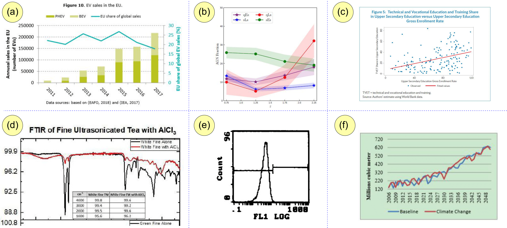

# LG Dataset 

[**Download Dataset 🤗**](https://huggingface.co/datasets/omoured/line-graphics-dataset) | [**Paper**](https://link.springer.com/chapter/10.1007/978-3-031-41734-4_27) | [**Video**](https://youtu.be/dK3YmN62kJc)

## Update (Nov/2023)
The dataset has been uploaded to [Huggingface](https://huggingface.co/datasets/omoured/line-graphics-dataset)! 
Check it out: https://huggingface.co/datasets/omoured/line-graphics-dataset 
## Description
we introduce the task of fine-grained visual understanding of mathematical graphics and present the [Line Graphics (LG) dataset](https://link.springer.com/chapter/10.1007/978-3-031-41734-4_27), which includes pixel-wise annotations of 5 coarse and 10 fine-grained categories. Our dataset covers 520 images of mathematical graphics collected from 450 documents from different disciplines.
 
## Samples
  Diverse mathematical graphics are covered in our Line Graphics (LG) dataset, including 100 bar charts (a) 320 line graphics (b,d-f), and 100 scatter plots (c). Each sample poses a significant challenge for existing chart analysis methods.

<table style="padding:10px">
     <tr>
        <td style="text-align:center">
            Images 
        </td>
    </tr>
    <tr>
        <td align="center" style="text-align:center"> 
            
        </td>
    </tr>
    <tr>
        <td style="text-align:center">
            Annotations 
        </td>
    </tr>
    <tr>
        <td style="text-align:center"> 
            
        </td>
    </tr>


</table>

## Citation

If you find this useful for your work, please cite it as follows:

```bibtex
@inproceedings{moured2023line,
  title={Line Graphics Digitization: A Step Towards Full Automation},
  author={Moured, Omar and Zhang, Jiaming and Roitberg, Alina and Schwarz, Thorsten and Stiefelhagen, Rainer},
  booktitle={International Conference on Document Analysis and Recognition},
  pages={438--453},
  year={2023},
  organization={Springer}
}
```
